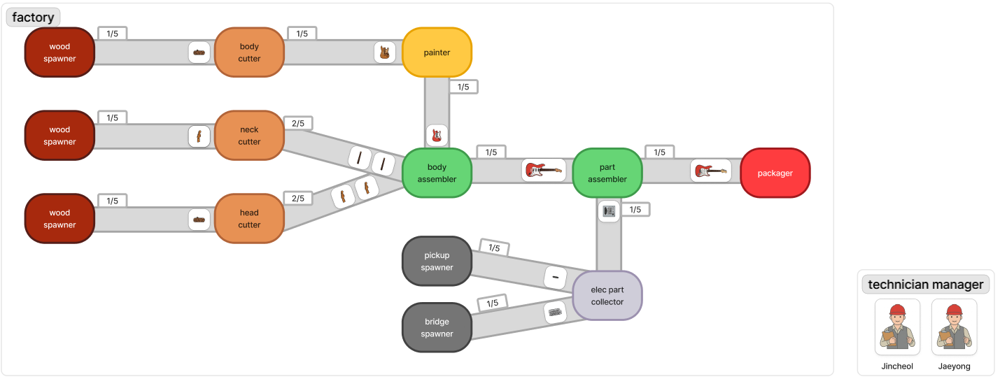

# Electric Guitar Factory Simulation

A tick-based factory pipeline simulator that produces electric guitars from raw wood and electronic parts. It simulates the cutting → painting → assembly → electronics → packaging process tick by tick and visualizes it in real time with Dear ImGui.

## Features

- Tick-based factory pipeline simulation (1x–5x speed)
- Machine breakdowns with automatic technician repair dispatch
- Five scenarios reproducing normal / breakdown / bottleneck / overflow / smart-factory situations
- Real-time intervention: machine selection, Force Break / Instant Repair
- Event log and statistics (finished goods, WIP, breakdowns, lost products)
- Memento-based rewind

## Scenarios

| Scenario | Breakdown Probability | Additional Effect |
|---|---|---|
| Normal | 0% | None |
| Breakdowns | 2% | Machine breakdowns occur |
| Bottleneck | 2% | Painter process time increased to 12 ticks |
| Overflow | 2% | WoodSpawner accelerated (1-tick interval) |
| SmartFactory | 2% | Conveyors switch to backpressure mode — upstream halts when downstream is full |

## Pipeline Overview

