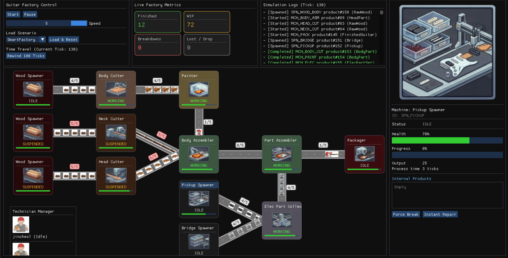
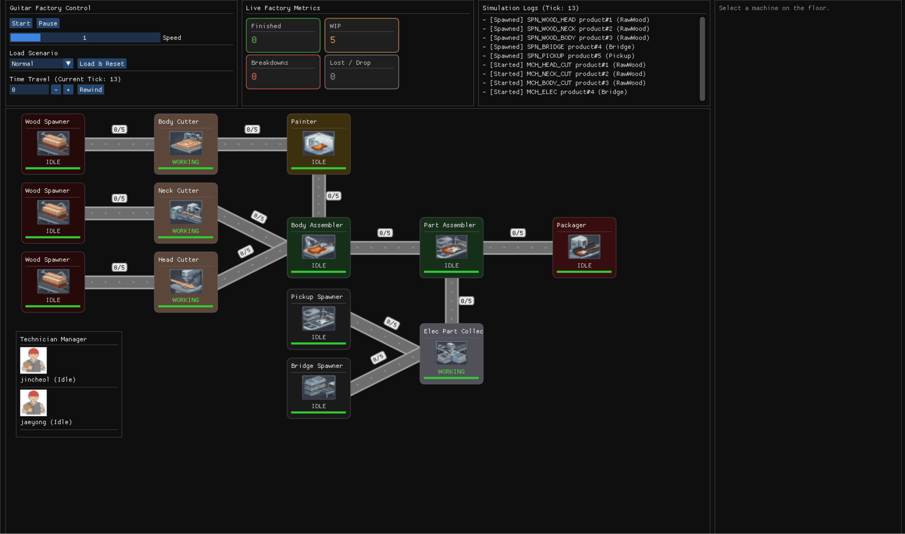
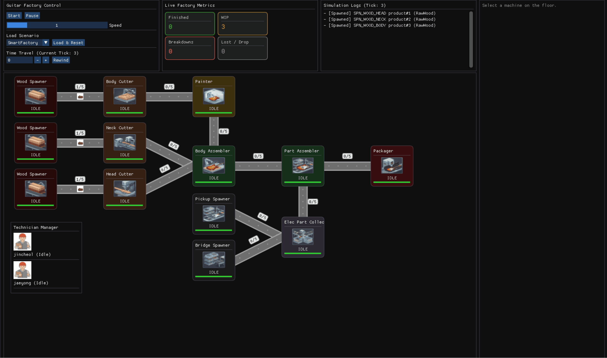

# Electric Guitar Factory Simulation

A tick-based factory pipeline simulator that produces electric guitars from raw wood and electronic parts. It simulates the cutting, painting, assembly, electronics, and packaging process tick by tick and visualizes it in real time with Dear ImGui.

## Features

- Tick-based factory pipeline simulation (1x to 5x speed)
- Machine breakdowns with automatic technician repair dispatch
- Five scenarios reproducing normal, breakdown, bottleneck, overflow, and smart-factory situations
- Real-time intervention: machine selection, Force Break / Instant Repair
- Event log and statistics (finished goods, WIP, breakdowns, lost products)
- Memento-based rewind

## Scenarios

| Scenario | Breakdown Probability | Additional Effect |
|---|---|---|
| Normal | 0% | None |
| Breakdowns | 2% | Machine breakdowns occur |
| Bottleneck | 2% | Painter process time increased to 12 ticks |
| Overflow | 2% | WoodSpawner accelerated (1-tick interval) |
| SmartFactory | 2% | Conveyors switch to backpressure mode, upstream halts when downstream is full |

## Overview



## UI Simulation (Normal Scenario)



## UI Simulation (SmartFactory Scenario)



## Architecture

The project follows an MVC structure. The model holds the simulation domain, the view renders ImGui panels, and the controller bridges user input to the model.

- Backend (model and controller): [backend-uml.svg](./diagrams/backend-uml.svg)
- Frontend (view): [frontend-uml.svg](./diagrams/frontend-uml.svg)

## Directory Structure

```
im-guitar/
├── src/
│   ├── main.cpp            # Entry point
│   ├── common/             # Shared types, events, snapshots, texture loader
│   ├── model/              # Simulation domain (factory, machines, conveyors, ...)
│   ├── view/               # ImGui panels (Control, FactoryFloor, Inspector, Log, Stats)
│   └── controller/         # Routes UI commands to the model
├── scenarios/              # Scenario configs (JSON)
├── assets/                 # Runtime assets (packaged into the build)
├── diagrams/               # UML and pipeline diagrams
├── context/                # Design docs and requirements
├── tests/                  # Unit tests (GoogleTest)
├── libs/                   # Vendored dependencies
└── CMakeLists.txt
```

Key parts of `src/model/`:

- `factory/` orchestrates the simulation. `SimulationRunner` advances the world one tick at a time.
- `machine/` and `conveyor/` model the pipeline stages and the transport between them. Machines use a state pattern (running, broken, repairing).
- `repair_dispatcher/` and `technician/` handle breakdown response: a dispatcher assigns a free technician to a broken machine.
- `memento/` snapshots world state each tick so the simulation can rewind.
- `scenario/` loads scenario configs from `scenarios/*.json`.
- `event/` and `stats/` collect the event log and aggregate statistics shown in the UI.

## Prerequisites

- A C++17 compiler (GCC 13+, Clang, or MSVC)
- CMake 3.14+
- SDL2 development package

Install SDL2:

```bash
# Ubuntu / Debian
sudo apt install libsdl2-dev

# Windows (MSYS2 / pacman)
pacman -S mingw-w64-x86_64-SDL2
```

nlohmann/json is fetched automatically by CMake (FetchContent). Dear ImGui is not fetched, so clone it into `libs/imgui` before building (see below).

## Build and Run

Clone Dear ImGui into `libs/imgui` first:

```bash
git clone https://github.com/ocornut/imgui.git libs/imgui
```

Then build and run:

```bash
cmake -B build
cmake --build build
cd build && ./app
```

The app loads assets via the relative path `../assets`, so run it from inside the `build` directory.

### Tests

```bash
cmake --build build --target unit_tests
./build/unit_tests
```
